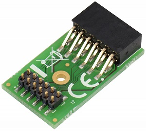
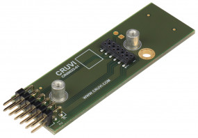
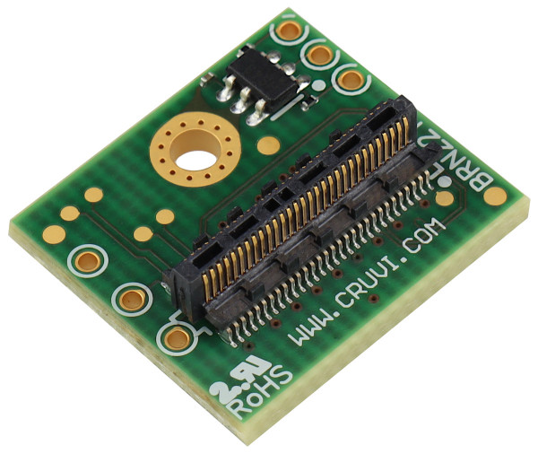
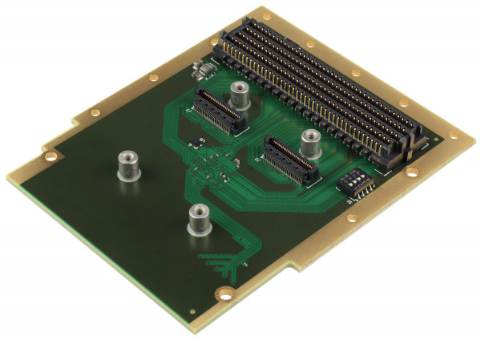

List of Adapter boards
======================

List of various adapter boards converting to/from some other form-factor or standard.

CR00005 to Pmod Adapter
-----------------------

This is purely passive 1:1 Adapter from CRUVI LS to Pmod connector. There are only two connectors and no active or passive components on board.

CR00025 from Pmod Adapter
-------------------------

This is purely passive 1:1 Adapter from Pmod to CRUVI LS connector. There are only two connectors and no active or passive components on board. For optional 5V VBUS voltage there are pin header holes for optional power header.

CR00091 Loopback Adapter
------------------------

Loopback adapter for CRUVI HS slot. All signals are looped back for test purposes. Voltage rails have LED's to indicate voltage presence.

CR00101 FMC Adapter
-------------------

FMC to CRUVI HS adapter for low profile HS modules. Note for other HS modules (not low profile) another FMC card must be used. Single and dual wide CRUVI HS boards are supported.

