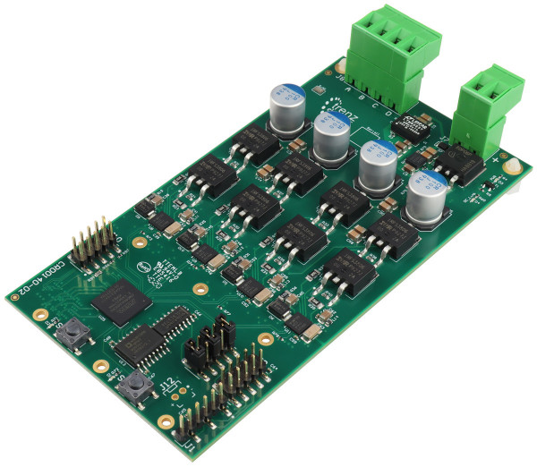

HS Modules
==========

CR00041 HyperRAM/xSPI
---------------------

This module can be assembled with HyperRAM, HyperFlash or Octal/xSPI Flash, they all share common footprint.

CR00045 PSRAM
-------------
.. image:: HS_Modules/CR00045-01-3D.jpg

PSRAM add-on board for AP Memroy PSRAM devices, 8 and 16 bit mode supported. VCCIO adjustable must be 1.8V.

CR00049 eMMC
------------

CRUVI HS board with eMMC device.

CR00140 Motor control
---------------------

CRUVI HS board for motor control application. Tripple wide HS board with extended length.

CR00200 Ethernet 88E1512
------------------------
.. image:: HS_Modules/CR00200-01-3D.jpg

This adapter board follows CRUVI specification for RGMII interface. VCC adjustable range 1.8 to 3.3V.

CR00201 Ethernet ADIN1300
-------------------------
This module is in pre-production, available soon!

This adapter board follows CRUVI specification for RGMII interface. VCC adjustable range 1.8 to 3.3V.

This module is very similar to CR00200 with the exception that different PHY is in use ADIN1300 from Analog Devices.

CR00202 Ethernet 88E1512 Dual
-----------------------------
.. image:: HS_Modules/CR00202-01-3D.jpg

This adapter board follows CRUVI specification for dual RGMII interface. VCC adjustable range 1.8 to 3.3V.

CR00203 Ethernet ADIN1300 Dual
------------------------------
This module is in pre-production, available soon!

This adapter board follows CRUVI specification for dual RGMII interface. VCC adjustable range 1.8 to 3.3V.

This module is very similar to CR00202 with the exception that different PHY is in use ADIN1300 from Analog Devices.
