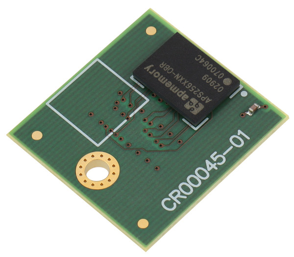
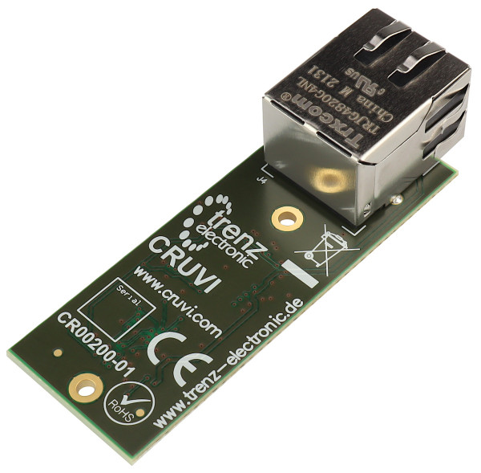
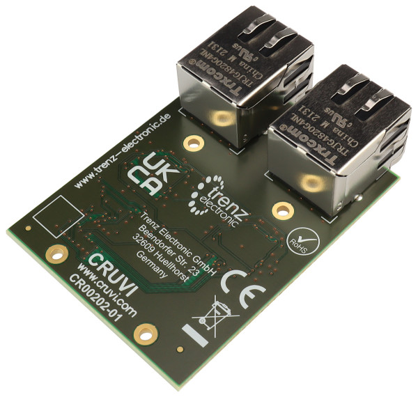

HS Modules
==========

CR00041
-------

HyperRAM

CR00041 PSRAM
-------------

PSRAM add-on board for AP Memroy PSRAM devices, 8 and 16 bit mode supported. VCCIO adjustable must be 1.8V.

CR00200 Ethernet
----------------

CR00202 Ethernet Dual
---------------------

