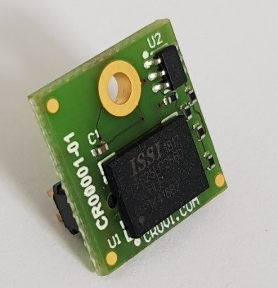
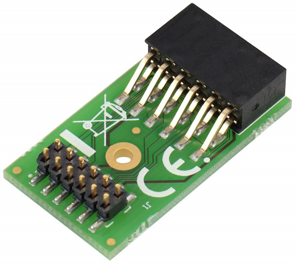

List of CRUVI LS (Low Speed) modules
====================================

CR00001 SPI Flash
-----------------

This module is a simple SPI Flash adapter. Can be assembled with any SPI flash in BGA24 4x6 mm package. Note that only 3.3V types are supported by the CRUVI LS hosts. I2C identification EEPROM is provided.

CR00005 to Pmod Adapter
-----------------------

CR00025 from Pmod Adapter
-------------------------

