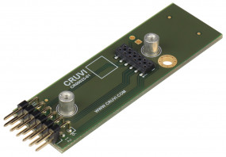

List of CRUVI LS (Low Speed) modules
====================================

CR00001 SPI Flash BGA24
-----------------------
.. image:: LS_Modules/CR00001-01-3D.jpg

This module is a simple SPI Flash adapter. Can be assembled with any SPI flash in BGA24 6x8 mm package. 
Note that only 3.3V SPI Flashes are supported by the CRUVI LS hosts. I2C identification EEPROM is provided.

+-------+----------+-------+
| CRUVI | Net Name | Note  |
+=======+==========+=======+
| 1     | I2C SDA  |       |
+-------+----------+-------+
| 2     | I2C SCL  |       |
+-------+----------+-------+
| 3     | SPI DQ3  |       |
+-------+----------+-------+
| 4     | SPI CS   |       |
+-------+----------+-------+
| 5     | SPI DQ2  |       |
+-------+----------+-------+
| 7     | SPI DQ1  |       |
+-------+----------+-------+
| 8     | SPI SCK  |       |
+-------+----------+-------+
| 9     | SPI DQ0  |       |
+-------+----------+-------+
| 6     | GND      |       |
+-------+----------+-------+
| 10    | VCC      | 3.3V  |
+-------+----------+-------+

CR00005 to Pmod Adapter
-----------------------
.. image:: LS_Modules/CR00005-01-3D.jpg

CR00025 from Pmod Adapter
-------------------------

