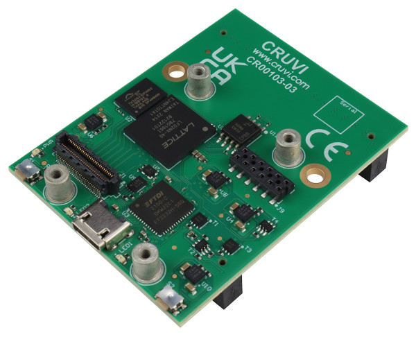
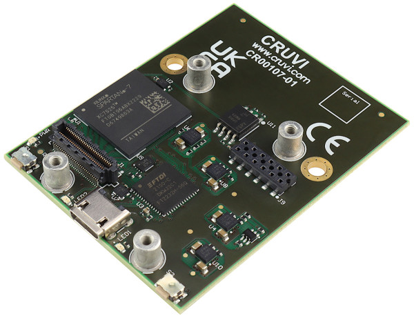
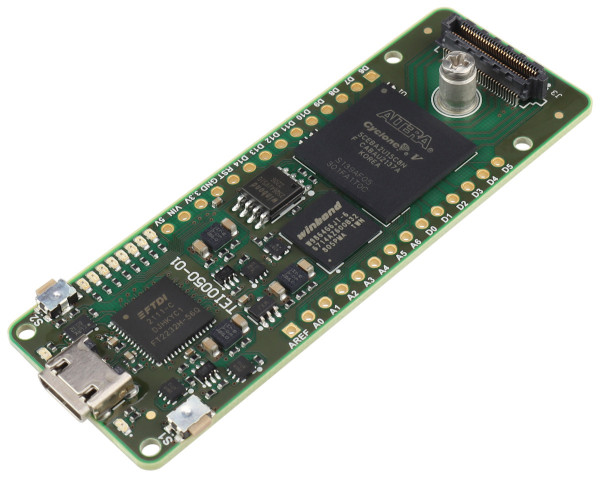

Mini Carriers
=============
This is a list of "mini" carrier boards for CRUVI modules. It is also possible to use them in reverse mode as a SoM.

CR00010 MAX10
-------------

This is a special mini carrier developed and produced for exclusive use by VHDPlus as `Core MAX10 <https://vhdplus.com/docs/components/vhdpcore_max10/>`_.

Note that the 100mil pin headers on the bottom side of the board are not covered by the CRUVI Standard.

Additional information can be found at VHDPlus website.

CR00100 MAX10
-------
.. image:: Mini_Carriers/CR00100-01-3D.jpg

CR00103 Certus-NX
-----------------

CR00107 Spartan-7
-----------------

TEI0050 Cyclone V
-----------------

Mini carrier (aka CYC5000) with Cyclone V FPGA. The base form factor is Arduino MKR format, with the addition of one CRUVI HS connector at the edge.

