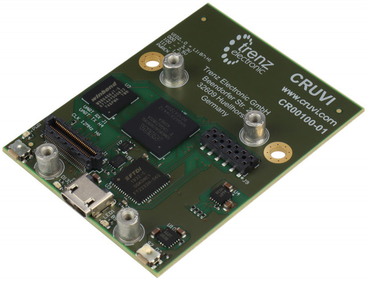

Mini Carriers
=============
This is a list of "mini" carrier boards for CRUVI modules. It is also possible to use them in reverse mode as a SoM.

CR00010
-------

This is a special mini carrier developed and produced for exclusive use by VHDPlus as `Core MAX10 <https://vhdplus.com/docs/components/vhdpcore_max10/>`_

Note that the 100mil pin headers on the bottom side of the PCB are not covered by the CRUVI Standard.

Additional information can be found at VHDPlus website.

CR00100
-------

CR00107
-------
.. image:: Mini_Carriers/CR00107-01-3D.jpg

Spartan7

