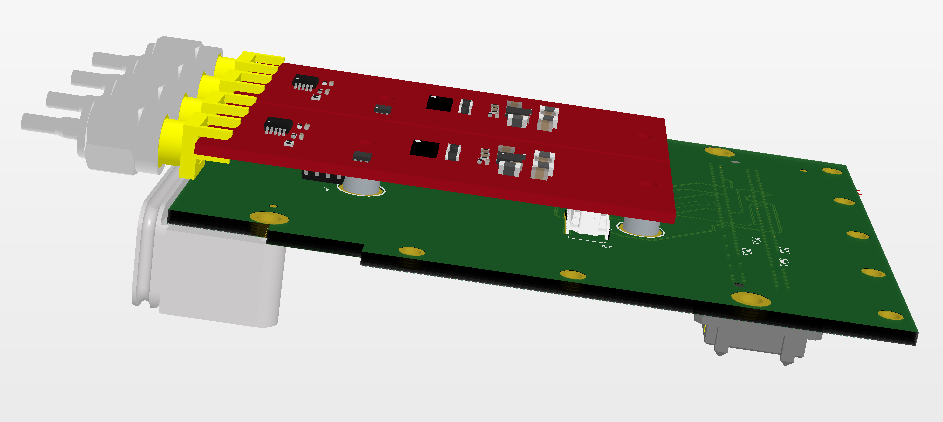

CRUVI Design Guide
==================

Mechanical
----------

All measurements are in mm except module to module spacing.

Module spacing: module-to-module spacing is fixed 900 mil (same as PMoD)

Module max width: 22mm this allows 0.86 mm between max width installed modules

Connectors
~~~~~~~~~~

Board-to-Board mating height: 5 mm both for LS as for HS connectors. Use only connectors with correct height:

+------------------------+--------------------+----------------------+
| Connector Type         | Carrier/Base       | Module/Function      |
+========================+====================+======================+
| HS High Speed          | SS4-30-3.50-L-D-K  | ST4-30-1.50-L-D-P    |
+------------------------+--------------------+----------------------+
| LS Low Speed           | CLT-106-02-F-D-A-K | TMMH-106-04-F-DV-A-M |
+------------------------+--------------------+----------------------+

FMC Compatibility
~~~~~~~~~~~~~~~~~

CRUVI modules designed as low profile and with FMC compatibility will fit inside standard FMC mezzanine module:

.. image:: CR00061-3D.png

FMC to CRUVI adapter, two single width CRUVI modules installed.

For evaluation and testing CRUVI connectors can be on the other side of the FMC in that case all CRUVI modules would fit.

